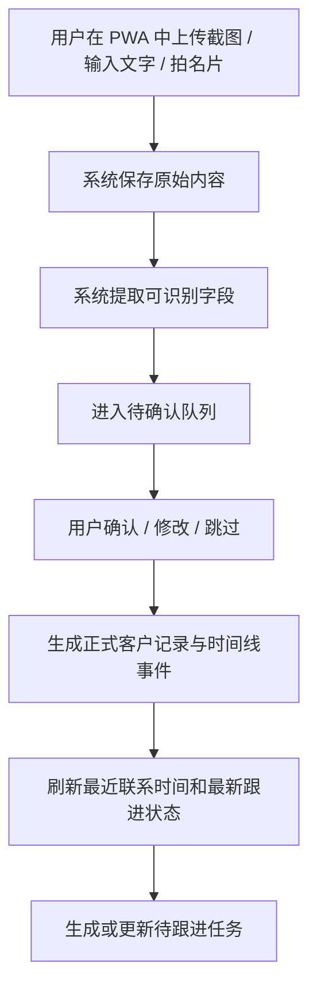
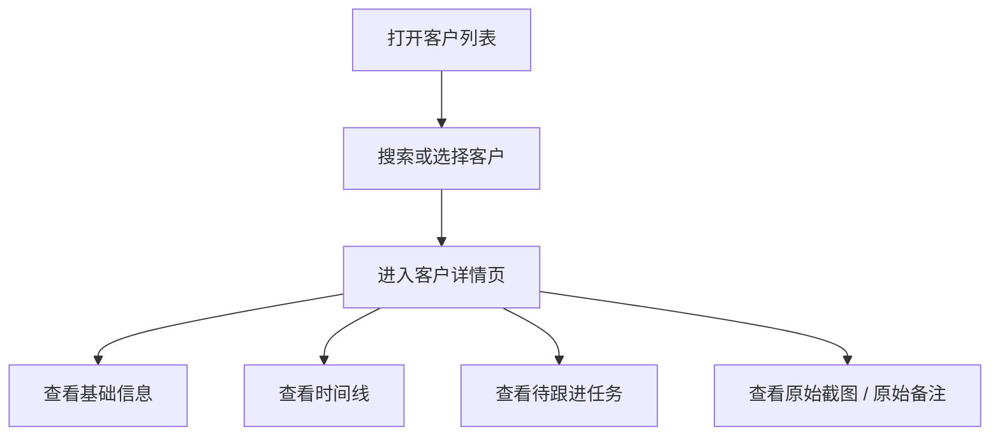
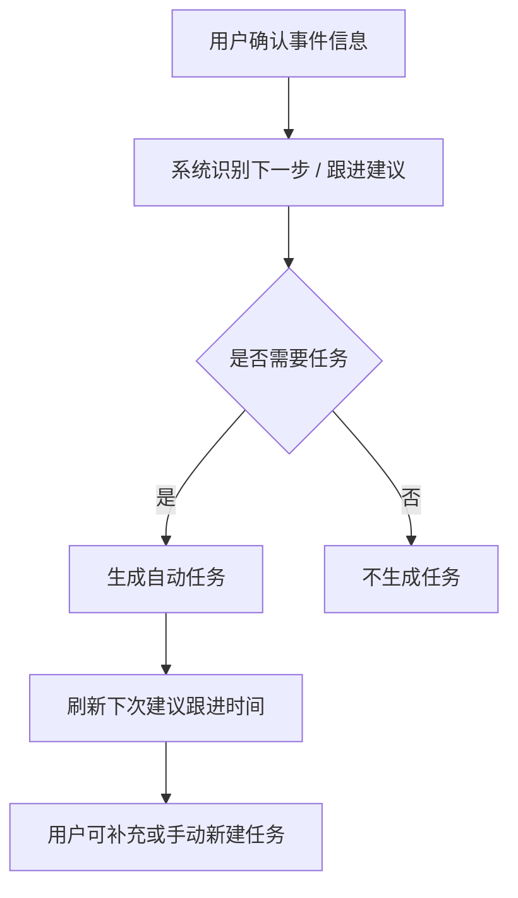
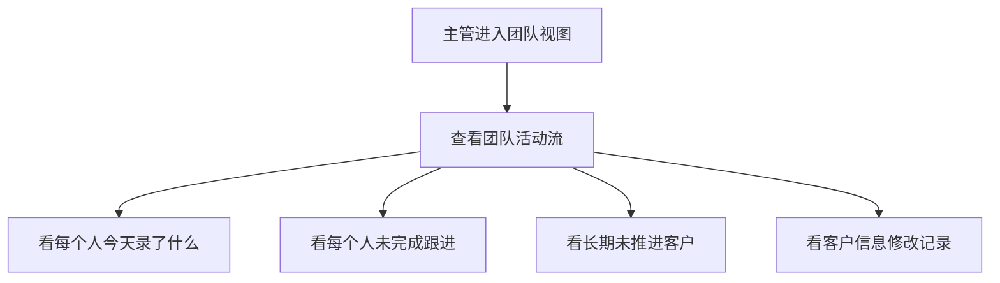

## 1. 文档目的

这份文档只描述第一版的关键业务流，不描述代码实现。

---

## 2. 核心录入流程

---

## 3. 客户查看流程

---

## 4. 任务形成流程

---

## 5. 未来团队监督流程（预留）

---

## 6. 当前结论

第一版的流程中心不是“自动化处理”，而是：

- 先顺手录入
- 再人工确认
- 最后沉淀成客户时间线、最新跟进状态和跟进任务
